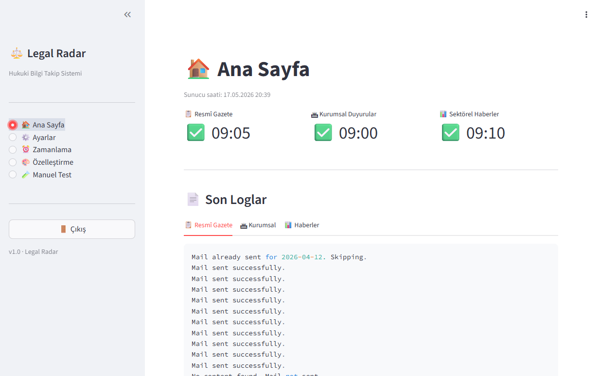

# ⚖️ Legal Radar

**TR** | [EN](#english)

Türk hukuk profesyonelleri için tasarlanmış, otomatik yasal takip ve bildirim sistemi.
Her sabah düzenleyici kurumları, resmî gazeteyi ve sektörel haberleri tarar; özetleyerek e-posta ile iletir.

---

## 🇹🇷 Türkçe

### Nedir?

Legal Radar, her sabah otomatik olarak üç farklı e-posta gönderir:

- 📋 **Resmî Gazete Özeti** — Günün yayınlarından önemli maddelerin yapay zeka destekli özeti
- 🏛 **Kurumsal Duyurular** — Resmi kurumların günlük duyuruları
- 📊 **Sektörel Haberler** — Belirlediğiniz sektörlere göre filtrelenmiş günlük haber özeti

### Özellikler

- ✅ Tam otomatik — kurulduktan sonra müdahale gerektirmez
- ✅ Web paneli — teknik bilgi gerektirmeden tarayıcıdan yönetim
- ✅ Özelleştirilebilir — sektörler, anahtar kelimeler, RSS kaynakları
- ✅ Kurumları açıp kapatabilme
- ✅ Yapay zeka destekli özetleme (Google Gemini)
- ✅ 7/24 çalışır (VPS üzerinde)

### Panel

### Kurulum

Adım adım kurulum kılavuzu için → [KURULUM.md](KURULUM.md)

Tahmini kurulum süresi: 45-60 dakika  
Aylık maliyet: ~4-5€ (yalnızca VPS)

---

## 🇬🇧 English

### What is it?

Legal Radar is an automated legal monitoring system designed for Turkish legal professionals.
It sends three daily e-mails every morning:

- 📋 **Official Gazette Summary** — AI-powered summary of the day's important entries
- 🏛 **Regulatory Announcements** — Daily updates from official institutions
- 📊 **Sector News Digest** — Filtered daily news based on your chosen sectors

### Features

- ✅ Fully automated — no intervention required after setup
- ✅ Web panel — manage everything from your browser
- ✅ Customizable — sectors, keywords, RSS sources
- ✅ Enable/disable institutions individually
- ✅ AI-powered summarization (Google Gemini)
- ✅ Runs 24/7 on a VPS

### Installation

See [KURULUM.md](KURULUM.md) for step-by-step setup instructions (Turkish).

Estimated setup time: 45-60 minutes  
Monthly cost: ~€4-5 (VPS only)

---

Built by [Kadir Özdemir](https://github.com/kadir-ozdemir)
